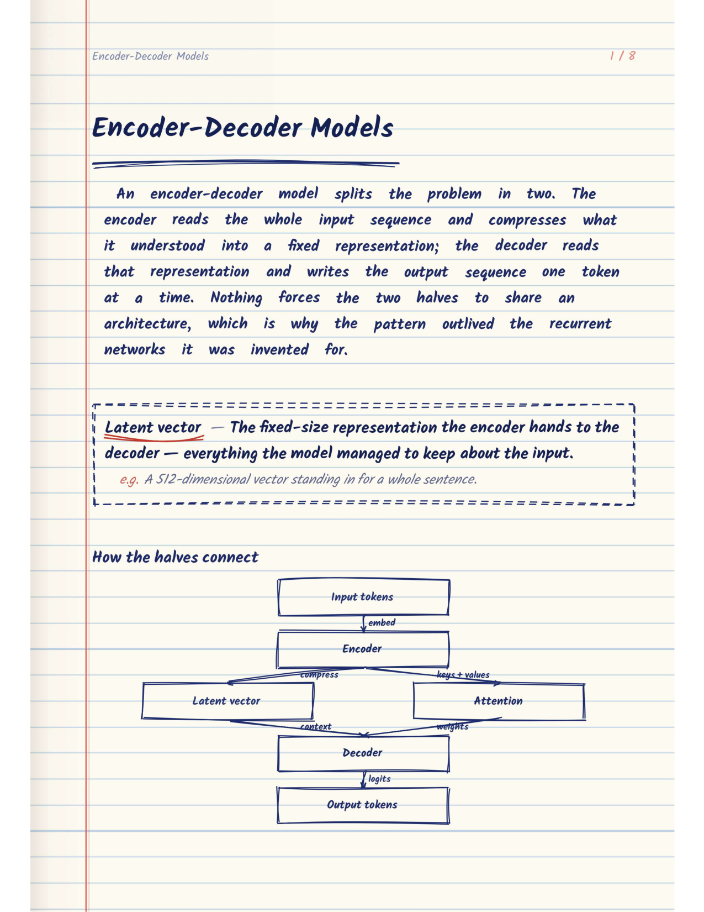
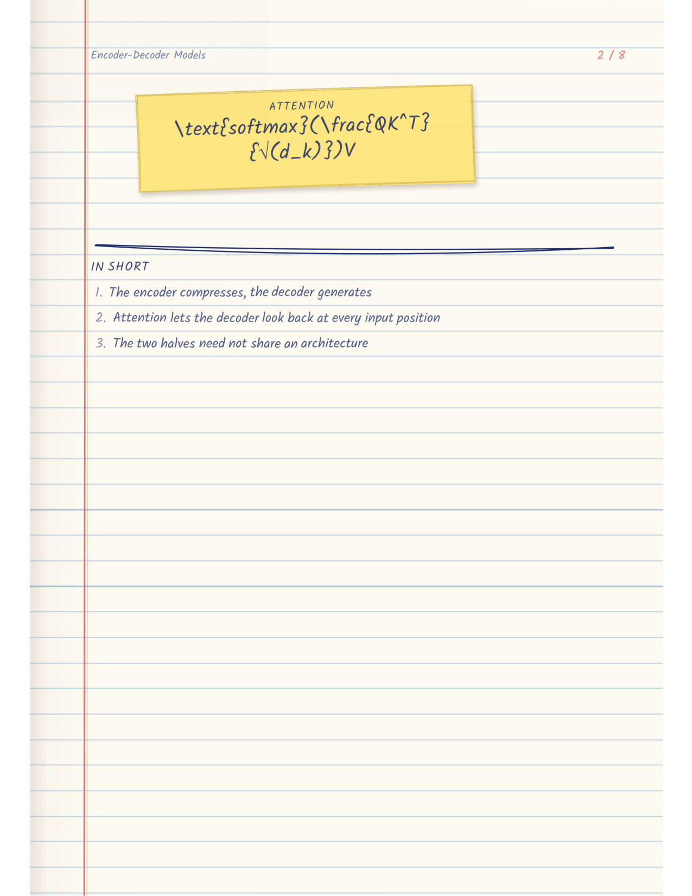
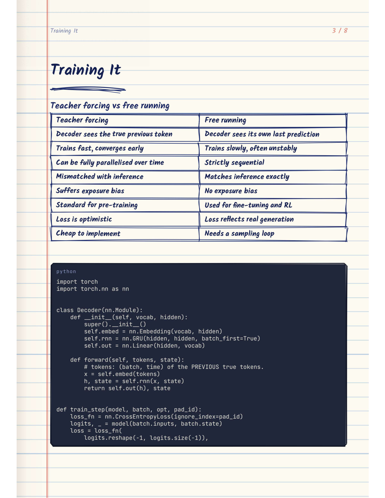
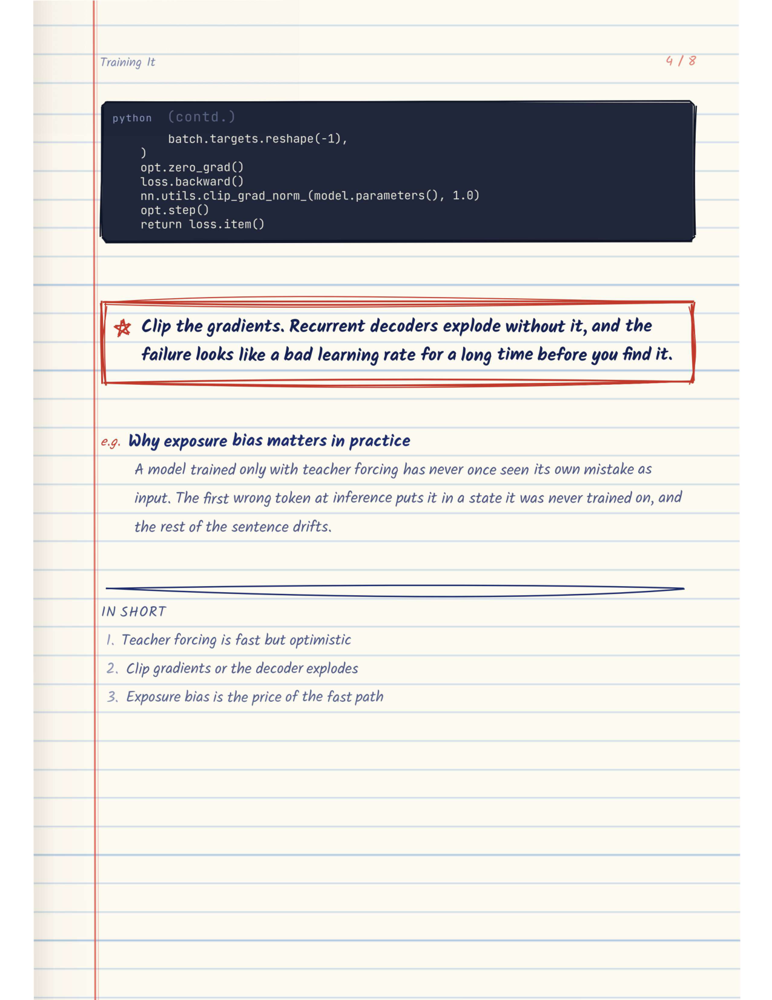
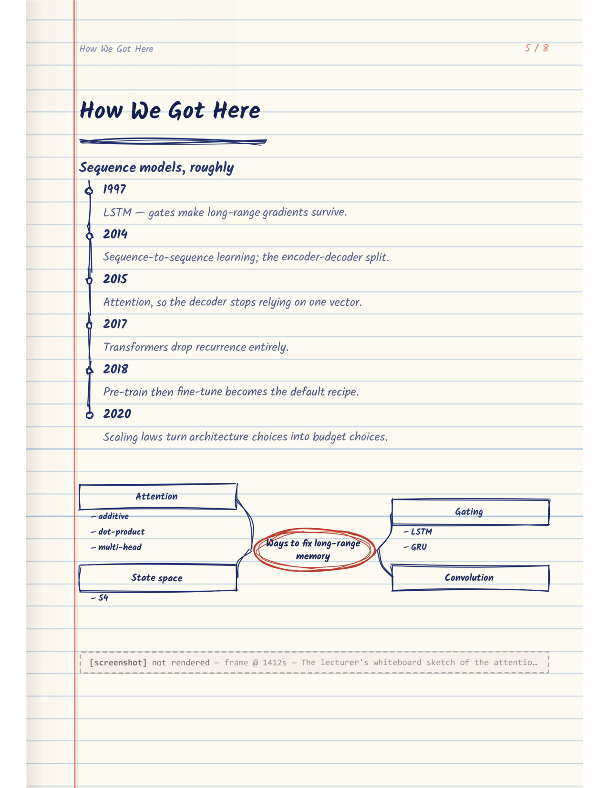
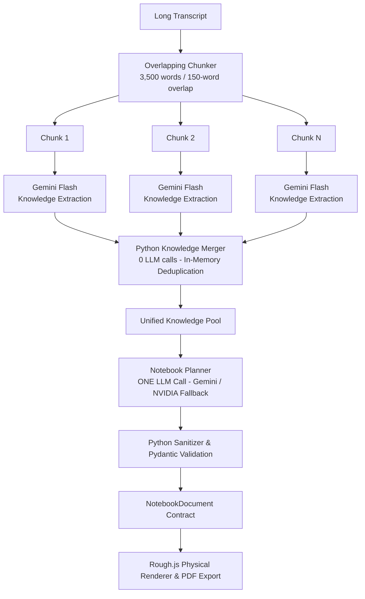

# 📝 RoughPage AI

> **Transform long YouTube lectures and dense transcripts into authentic, hand-drawn study notebooks and multi-page PDFs.**

[](https://nextjs.org/)
[](https://fastapi.tiangolo.com/)
[](https://python.org/)
[](https://ai.google.dev/)
[](https://build.nvidia.com/)
[](https://roughjs.com/)
[](LICENSE)

---

## 📖 Table of Contents

- [Overview](#-overview)
- [✨ Output Gallery (Generated PDFs)](#-output-gallery-generated-pdfs)
- [🚀 Key Features](#-key-features)
- [🧠 AI Architecture & Pipeline](#-ai-architecture--pipeline)
- [🧩 Supported Notebook Elements](#-supported-notebook-elements)
- [🏗️ System Structure](#️-system-structure)
- [🛠️ Getting Started](#️-getting-started)
  - [Prerequisites](#prerequisites)
  - [1. Clone and Environment Setup](#1-clone-and-environment-setup)
  - [2. Backend Setup (FastAPI)](#2-backend-setup-fastapi)
  - [3. Frontend Setup (Next.js)](#3-frontend-setup-nextjs)
- [⚙️ Environment Variables](#️-environment-variables)
- [📄 License](#-license)

---

## 🌟 Overview

**RoughPage AI** converts video lectures into notes that look like they were handwritten by an A+ student in a college-ruled notebook.

Traditional AI summarizers spit out dry, generic bullet points. RoughPage extracts concepts, mathematical formulations, algorithms, and tradeoffs, then renders them as **authentic sketchy notebooks** complete with:
- Lined notebook paper texture with red margins and blue horizontal guides.
- Hand-drawn geometric shapes and flowcharts rendered via **Rough.js**.
- Handwritten typography powered by the **Kalam** font family.
- Color-coded sticky notes, star callout boxes, and hand-drawn comparison tables.
- A **multi-provider AI architecture** featuring **Google Gemini** as the primary engine and **NVIDIA NIM** as an automatic fallback chain.

---

## ✨ Output Gallery (Generated PDFs)

Here is what RoughPage generates from technical transcripts and college lectures:

### 1. Conceptual Breakdown & Hand-Drawn Flowcharts
Structured definitions in dashed boxes, natural hand-drawn flowcharts with directional arrows, and clear visual hierarchy.

<p align="center">
  
</p>

---

### 2. Sticky Formulas & Key Summaries
Mathematical formulas highlighted on textured post-it notes alongside concise key takeaways.

<p align="center">
  
</p>

---

### 3. Comparison Tables & Formatted Code
Side-by-side conceptual comparison matrices sketched with pencil-like borders, followed by syntax-highlighted code implementations.

<p align="center">
  
</p>

---

### 4. Important Callout Boxes & Warnings
Double-bordered red star notes for critical exam warnings and architectural traps.

<p align="center">
  
</p>

---

### 5. Historical Timelines & Concept Mind Maps
Milestone sequence trees with pin markers, paired with circular radiating mind maps.

<p align="center">
  
</p>

---

## 🚀 Key Features

- **Multi-Provider AI Resilience**:
  - **Primary**: Google Gemini API (`gemini-2.5-flash` for extraction & JSON repair, `gemini-2.5-flash` / `gemini-2.5-pro` for notebook planning).
  - **Fallback**: NVIDIA NIM (`deepseek-ai/deepseek-v4-flash-0731`, `minimaxai/minimax-m2.7`, `nvidia/nemotron-3-nano-omni-30b-a3b-reasoning`).
  - Strict error classification: Temporary errors (429, 503, timeouts) trigger fallback; permanent errors (404, 410 EOL) skip immediately without burning retries.

- **Dual-Mode Transcript Pipeline**:
  - **Short/Medium Lectures (<12,000 words)**: Single-pass direct generation for speed and cohesion.
  - **Massive Lectures (>12,000 words / 90+ min)**: $N$ chunk extractions $\rightarrow$ Python deduplication merger $\rightarrow$ 1 global Planner call.

- **Zero AI Redundancy**:
  - The Python Knowledge Merger operates in memory with **0 LLM calls**, deduplicating concepts and formulas before planning.

- **Decoupled Architecture**:
  - AI decides **WHAT** content belongs in the notebook.
  - Pydantic schema strictly defines the content structure.
  - Browser measurement decides **HOW** elements physically fit on pages.

- **PDF & Cloud Storage**:
  - Automated high-DPI PDF generation via browser automation.
  - Cloud storage and personal note library synchronization with Supabase.

---

## 🧠 AI Architecture & Pipeline

### Large Transcript Flow (>12,000 words)



### Provider Routing & Fallback Logic

```
Google Gemini (Primary)
    │
    ▼ (on timeout, 429, 503)
NVIDIA DeepSeek V4 Flash
    │
    ▼ (on failure or timeout)
NVIDIA MiniMax M2.7 / Nemotron Omni
    │
    ▼ (on exhaustion)
Controlled Error
```

---

## 🧩 Supported Notebook Elements

| Element | Description | Visual Style |
| :--- | :--- | :--- |
| `heading` | Main topics and section transitions | Large handwritten text with wavy underlines |
| `definition` | Formal terminology and meanings | Dashed border with bold terms and example tags |
| `sticky_formula` | Key equations, laws, and math relations | Yellow post-it note with LaTeX math rendering |
| `flowchart` | Algorithms, lifecycle states, pipelines | Hand-sketched boxes connected with pencil arrows |
| `comparison_table` | Tradeoff matrices and versus lists | Pencil-ruled table grid with alternating cells |
| `important_note` | Critical exam warnings, gotchas, rules | Red double-bordered callout box with star icon |
| `timeline` | Chronological evolutions and histories | Vertical marker line with milestone pins |
| `mind_map` | Central themes radiating to sub-concepts | Circled core node with hand-drawn branch lines |
| `bullet_list` | Quick summaries and itemized lists | Handwritten dashes or bullet points |
| `code_block` | Python, JavaScript, and algorithm snippets | Dark terminal card with syntax highlighting |

---

## 🏗️ System Structure

```
Rough/
├── backend/                        # FastAPI REST API & AI Service
│   ├── app/
│   │   ├── api/routes/             # Notebook generation & library endpoints
│   │   ├── config.py               # Pydantic settings & env validation
│   │   ├── schemas/                # Pydantic models (NotebookDocument, Page, Elements)
│   │   └── services/
│   │       ├── ai/                 # Core AI Service
│   │       │   ├── providers/      # Multi-provider abstraction (Gemini, NVIDIA, Router)
│   │       │   ├── prompts/        # System prompts, user prompts, chunker
│   │       │   ├── knowledge_extractor.py
│   │       │   └── knowledge_merger.py
│   │       ├── transcript/         # YouTube transcript & audio extractors
│   │       └── supabase_db.py      # Cloud database & storage client
│   └── requirements.txt
│
├── frontend/                       # Next.js Web App
│   ├── app/                        # App router (dashboard, reader, library)
│   ├── components/                 # UI components (Sketch, PenProgress, LibraryGrid)
│   └── lib/                        # API clients & Supabase browser setup
│
├── renderer/                       # Rough.js Handwritten Canvas & PDF Generator
│   ├── components/                 # Handwritten component primitives
│   └── scripts/                    # Headless PDF rendering script
│
├── docs/                           # Documentation & sample assets
│   └── sample_pages/               # High-res sample page previews
│
└── testpfd/                        # Sample output test PDFs
```

---

## 🛠️ Getting Started

### Prerequisites
- **Node.js** 18+ and **npm**
- **Python** 3.10+
- A **Google Gemini API Key** ([Google AI Studio](https://aistudio.google.com/))
- *(Optional)* An **NVIDIA NIM API Key** ([NVIDIA Build](https://build.nvidia.com/)) for fallback redundancy

---

### 1. Clone and Environment Setup

```bash
git clone https://github.com/your-username/RoughPage.git
cd RoughPage
```

Create a `.env` file in the root directory (see [Environment Variables](#️-environment-variables)).

---

### 2. Backend Setup (FastAPI)

```bash
cd backend

# Create and activate virtual environment
python -m venv venv

# Windows
.\venv\Scripts\activate
# macOS/Linux
source venv/bin/activate

# Install dependencies
pip install -r requirements.txt

# Start FastAPI server
uvicorn app.main:app --reload --port 8000
```

The backend documentation will be live at `http://localhost:8000/docs`.

---

### 3. Frontend Setup (Next.js)

In a new terminal:

```bash
cd frontend

# Install dependencies
npm install

# Start development server
npm run dev
```

Open `http://localhost:3000` in your browser.

---

## ⚙️ Environment Variables

Create a `.env` file in the root directory:

```env
# ── AI Providers ───────────────────────────────────────────────────────────
# Primary: Google Gemini
GEMINI_API_KEY=your_gemini_api_key_here
GEMINI_EXTRACTION_MODEL=gemini-2.5-flash
GEMINI_PLANNER_MODEL=gemini-2.5-flash

# Fallback: NVIDIA NIM
NVIDIA_API_KEY=your_nvidia_api_key_here
NVIDIA_MODEL=deepseek-ai/deepseek-v4-flash
NVIDIA_FALLBACK_MODEL=minimaxai/minimax-m2.7

# ── Supabase (Authentication & Storage) ───────────────────────────────────
SUPABASE_URL=https://your-project.supabase.co
SUPABASE_ANON_KEY=your-supabase-anon-key
NEXT_PUBLIC_SUPABASE_URL=https://your-project.supabase.co
NEXT_PUBLIC_SUPABASE_ANON_KEY=your-supabase-anon-key
STORAGE_BUCKET=Notes
```

---

## 📄 License

This project is licensed under the MIT License — see the [LICENSE](LICENSE) file for details.
